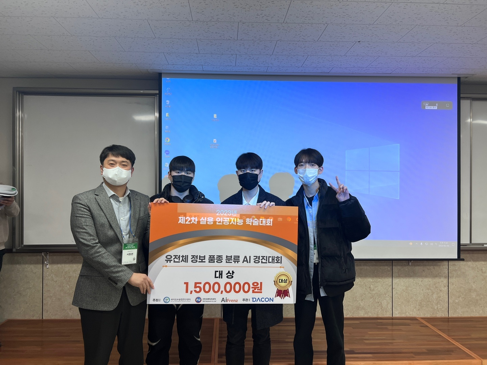

# Genomic Data Breed Classification

> First-place DACON solution for SNP-based breed classification using feature engineering, imbalance handling, and ensemble modeling.

## Overview

| Field | Details |
| --- | --- |
| Competition | 유전체 정보 품종 분류 AI 경진대회 |
| Period | 2022.12.12 - 2023.01.16 |
| Host | Chungnam National University BioAI Convergence Research Center |
| Platform | DACON |
| Result | 1st / 716 teams |
| Team | 3 members, team lead |
| Task | Multi-class breed classification from SNP/genomic data |
| Main metric | Macro F1 |

## Approach

- Built genotype-derived features from SNP name, chromosome, genetic distance, position, and nucleotide composition.
- Encoded high-cardinality categorical SNP features with CatBoost Encoder.
- Applied class-imbalance handling with SMOTE and BorderlineSMOTE variants.
- Compared tree boosting and classical ML models, including CatBoost, LightGBM, XGBoost, Random Forest, Extra Trees, SVC, and MLP.
- Combined strong models with weighted hard-voting ensembles for the final submission.

## Repository Structure

```text
.
|-- assets/
|   `-- award_photo.jpeg
|-- notebooks/
|   |-- 01_feature_engineering_baseline.ipynb
|   |-- 02_feature_engineering_smote_experiment.ipynb
|   |-- 03_feature_engineering_variant.ipynb
|   |-- 04_final_feature_set.ipynb
|   |-- 05_feature_selection_baseline.ipynb
|   |-- 06_model_comparison_fine_features.ipynb
|   |-- 07_model_comparison_new_features.ipynb
|   |-- 08_feature_selection_and_modeling.ipynb
|   |-- 09_boosting_ensemble_experiment.ipynb
|   |-- 10_catboost_experiment.ipynb
|   |-- 11_submission_ensemble_experiment.ipynb
|   |-- 12_final_submission_review.ipynb
|   `-- 13_final_competition_solution.ipynb
|-- reports/
|   |-- award_certificate.pdf
|   `-- final_competition_solution.pdf
`-- requirements.txt
```

## Award



DACON official certificate (verification code `#D20230214000003`): [`reports/award_certificate.pdf`](reports/award_certificate.pdf)

## Public Scope

The public repository keeps the solution notebooks and final solution PDF. Competition data, generated feature tables, trained models, and submission CSV files are intentionally excluded.

Notebook outputs, execution counts, Colab metadata, and local Google Drive paths were removed for public portfolio use.

## Links

- [DACON competition page](https://dacon.io/competitions/official/236035/overview/description)
- [DACON code share: Private 1st solution](https://dacon.io/competitions/official/236035/codeshare/7430)
- [AAiCON 2023 publication record](https://github.com/Minsu5452/AI_Frenz_2023_Publication)
